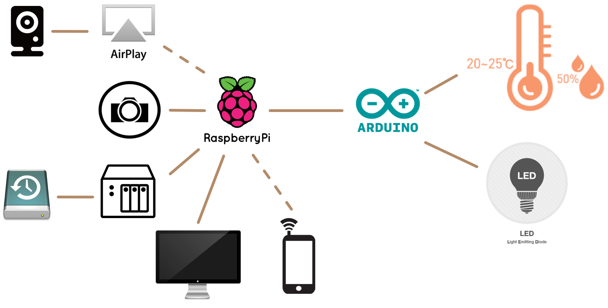
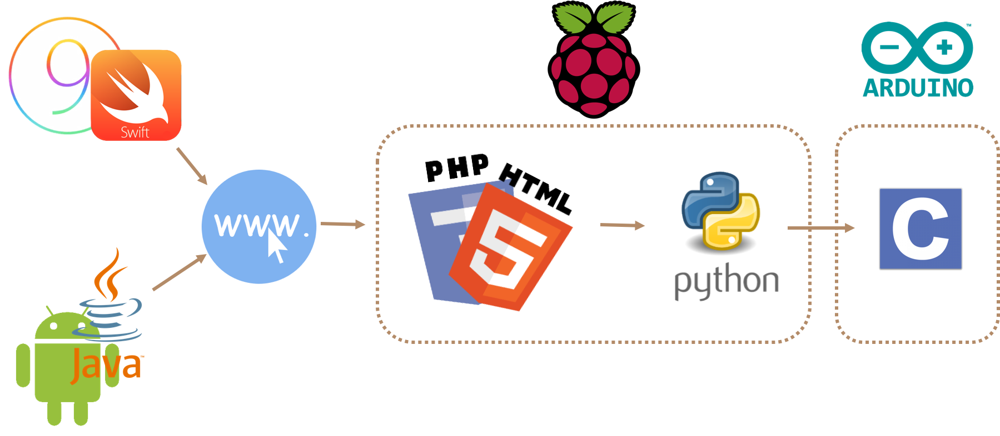
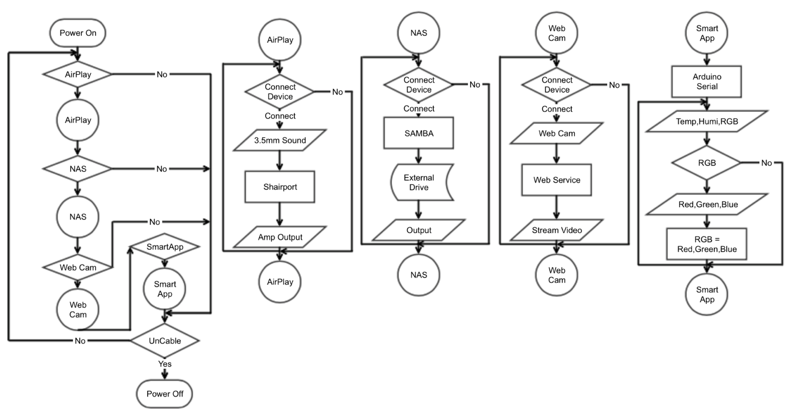
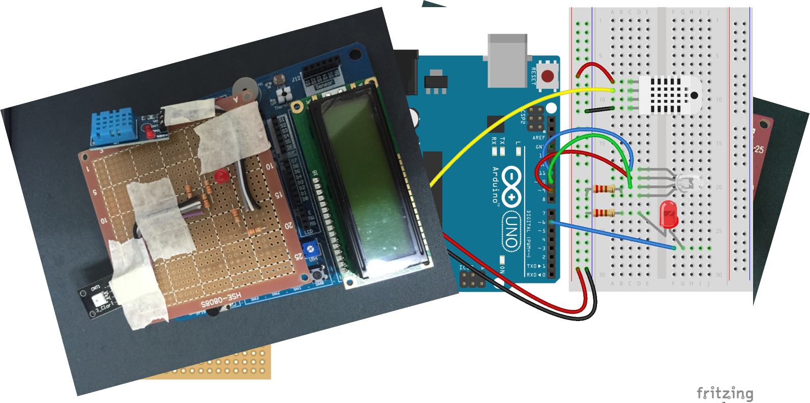
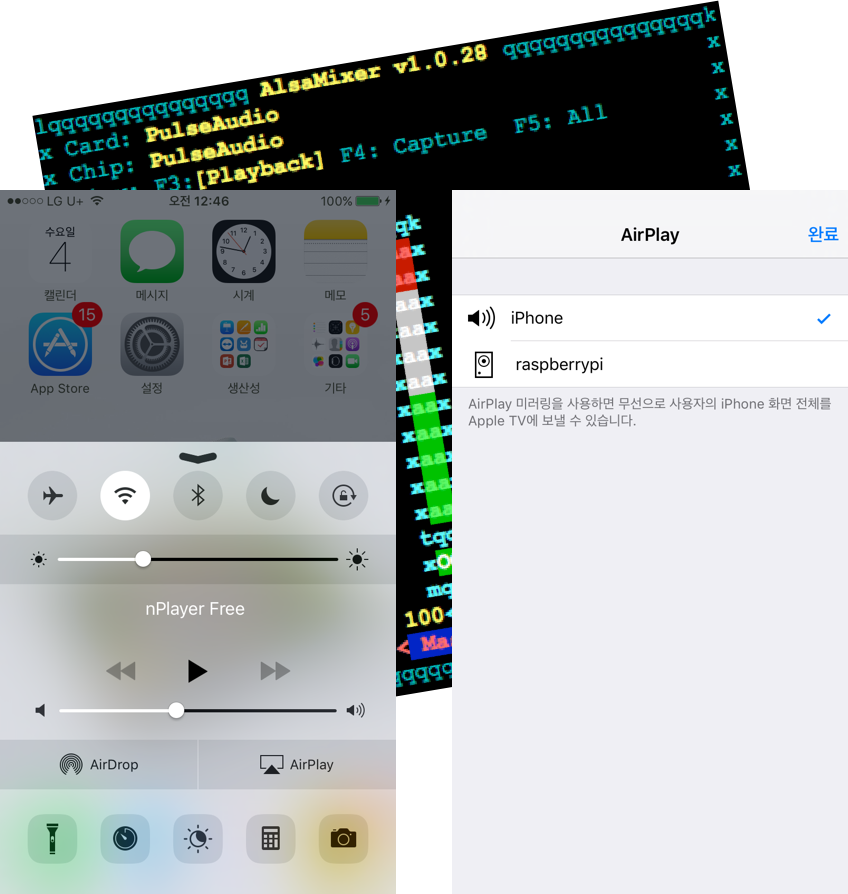
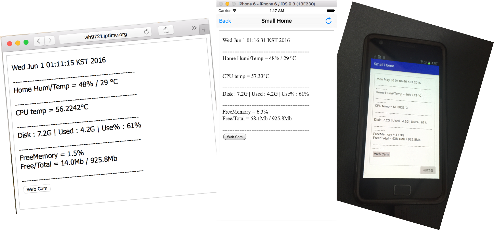

# Small IoT
+ 본 저장소는 Raspberry pi와 Arduino를 활용한 Small IoT 프로젝트를 위한 저장소입니다.

## 프로젝트 개요
### 프로젝트 기간
+ 2016.03 ~ 2016.06 (3개월)

### 담당업무
+ 계획, 설계, 구현

### Tools & Language
+ Arduino IDE, Python IDLE, putty, Tomcat 7
+ Raspberry pi -> HTML, PHP, Python
+ Arduino -> C
+ Smart Device -> iOS (Swift2), Android (Java)

### 목적
+ 라즈베리파이와 아두이노 및 센서를 이해하고 기반이 다른 장비간의 통신을 실습한다.

## 구현
### 요구 사항
1. 온도 및 습도 측정
2. RGB LED 활용 조명 제어
3. Live Web CAM을 활용한 보안 기술 
4. NAS 구현
5. Airplay(Audio)
6. Android / IOS App을 통한 모니터링

### 기능 구현
1. DHT 11 센서 활용 
2. RGB LED 활용
3. 구형 스마트폰 활용 
4. Samba 서버 활용
5. Shairport 서버 활용 
6. Web View 활용

+ 요구사항에 따른 프로젝트 구상도

+ 언어 연관도

+ 프로젝트 알고리즘

+ 센서 회로도 및 기판 제작

+ Airplay 동작 확인

+ 웹 / IOS / Android 결과값 확인
